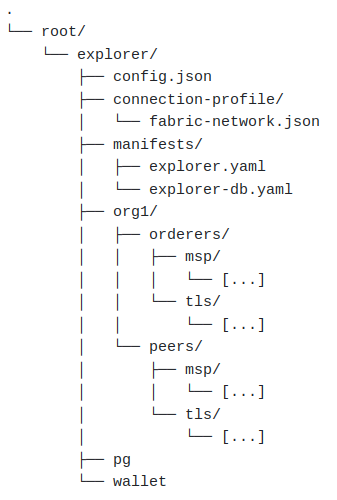

# Integration of Blockchain Explorer to Hyperledger Fabric

This document provides the process of integrating Blockchain Explorer to the deployed Hyperledger Fabirc network on
Kubernetes.

### 1. Setup Explorer directory

First we need to create a separate directory for the deployment of Explorer.
To this end, we use _/root/explorer_ directory which will be continued throughout this document, assuming that 
you have root permissions. If not, please feel free to choose an appropriate directory.

`mkdir -p /root/explorer`

Create a sub-folder by the organization name and copy all the crypto related files generated for peers and orderers during
their registration and enrollment processes. For an example (with respect to the folder structure referred in this 
[doc](deploy.md#ordererpeer)),

`mkdir -p /root/explorer/org1`\
`cp -r /root/hfb/org1/peers /root/explorer/org1/`\
`cp -r /root/hfb/org1/orderers /root/explorer/org1/`

### 2. Configuration files and manifests

Then copy _config.json_ and _fabric-network.json_ files in the _explorer_ directory of this repository to the _explorer_
directory in the instance. Create another subdirectory for manifests and copy `explorer.yaml` and `explorer-db.yaml` files 
in _k8s_ directory into this folder. 

Update each attribute (eg: <org-name>) in these copied files based on your use-case. Specifically, we need to mount 5 
different volumes in the manifests and hence create them in advance if do not already exist.

1. `explorer-db-pg-data`: for the database
2. `explorer-config`: for the configuration file of Explorer
3. `explorer-profile`: for the connection profiles
4. `explorer-crypto`: for the organization cryptography files (copied in step 1)
5. `explorer-wallet`: for certificate storage

Make sure to include the mounted paths (i.e. the internal file path within the container) for the key file and 
signed certificate of the peer admin (not peer) as well as the root CA certificate in the _fabric-network.json_ file.

The resulting folder structure should appear similar to the following.

    

### 3. Anchor peers

Explorer uses external gossip endpoints to communicate with the peers provided in the configuration. Thus it requires 
the configured peer(s) to be set as anchor peers in the organization. If it is already done, you may skip this step.

This process involves a number of commands to be executed as an update transaction to a channel but for convenience 
this repository provides an automated script to achieve this entire process. For an example, in order to set _peer2_ of
_org1_ as an anchor peer in channel _chan1_ with orderer *ord1* and channel config block residing in _/root/hfb/config/chan1/chan_block.pb_,
you may execute the _add-anchor-peer.sh_ script in _scripts_ directory as follows.

`bash add-anchor-peer.sh -c chan1 -f /root/hfb/config/chan1/chan_block.pb -p peer2 -o ord1 -n org1`

### 4. Dashboard

Finally, apply both manifest files updated in the previous step using _kubectl_ command. Make sure to expose the
corresponding port (eg: 8080) in case the deployment was done in a virtual machine. You can then access the dashboard 
with <ip>:<port> from the browser by providing the user credentials configured in _fabric-network.json_.
