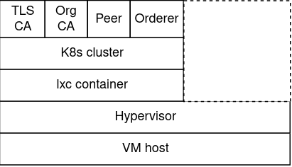

# FabriK

Fabrik contains bash scripts and corresponding [Kubernetes](https://kubernetes.io/) manifest files to automate
the deployment of [Hyperledger Fabric](https://www.hyperledger.org/projects/fabric) components in Unix-like environments.

Parameters and file paths related to Fabric components are defined as variables in the
scripts such that they can be modified as required. The relevant changes should also
be applied to the manifest files accordingly.

## Usage

1. Deploy the TLS CA: `bash scripts/deploy/tls-ca.sh`
2. Deploy the organization CA: `bash scripts/deploy/org-ca.sh -l`\
   Note: -l flag can be used when TLS CA is deployed locally on the machine which
    then automates the registration of the organization CA with TLS CA. If not, this step
    needs to be done manually before executing the script.
3. Remove a component: `bash scripts/remove-service.sh <k8s-service-name>`

## Architecture

The following stack of components provides an overview of a sample
architecture where the network is deployed.

  

