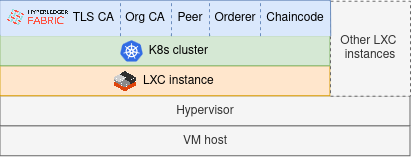
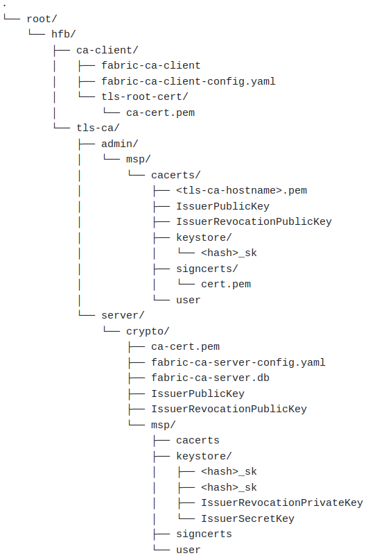

# FabriK

FabriK provides resources to deploy [Hyperledger Fabric](https://www.hyperledger.org/projects/fabric) on [Kubernetes](https://kubernetes.io/).

This IaC repository contains bash scripts and corresponding Kubernetes manifest files to
automate the deployment of Hyperledger Fabric components in Unix-like
environments. The documentation provides the steps to deploy a minimal working Fabric network using the resources in this repository.

Please refer to the [quickstart](#quickstart) for convenient and faster deployment of a network, which
will be carried out through the automation scripts.

Refer to the [detailed process](docs/deploy.md) for manual deployment of individual Fabric components.

## Architecture

The following stack of components provides an example architecture where the network was deployed successfully. 
However, a containerization layer (eg: LXC) is not mandatory to execute the scripts in this repository.

    

## Quickstart

This option provides automated scripts to bootstrap a Hyperledger Fabric network on Kubernetes with only a single
command. A number of Kubernetes services related to Fabric components will be deployed on the same instance which
primarily serves for development and testing purposes.

Kubernetes should be installed on the instance in advance. To **start** the network,

1. Move the _scripts_ folder to the instance (local or remote) where the Fabric network will be deployed
2. Execute the command `bash network.sh -i <hostname>` while replacing the hostname of the instance. This will start
   the network with a minimal setup (a TLS CA, an organization CA, a peer and an orderer) by using the default values.

In case of other scenarios, you can configure your network setup with CLI arguments.
For an example, if you need to start a network for the organization 'hfb-org' with 3 peers and 5 orderers
which will be hosted on _hfb-org.com_ and rooted in the directory _/networks/hfb-org_, you can execute the script as,

`bash network.sh -i hfb-org.com -p 3 -o 5 -n hfb-org -d /networks/hfb-org`

Run `bash network.sh -h` for more information on CLI arguments.

Note: Deploying K8s manifest files involve downloading docker images and creating containers which may be time consuming.
Therefore, a simple mechanism of a _sleep buffer_ is included in order to make sure that the subsequent steps in the scripts
are executed only when the corresponding K8s service is up and running. You may configure this (in seconds) buffer with
`-s` flag. For an example,

`bash network.sh -i hfb-org.com -p 3 -o 5 -n hfb-org -d /networks/hfb-org -s 20`

To **shutdown** the network, simply run `bash network.sh -r`

### Individual Components

You can also bootstrap individual Fabric components separately by using the corresponding script in
_scripts_ directory as explained below.

#### General notes

In each of the following scripts, the example commands contain only the minimal arguments required. However, you
may use additional parameters for granular configuration (which will be set to default values in scripts if not
provided). For example, scripts will generate the manifests required to deploy K8s services by default but you
may also explicitly provide any existing manifest file via CLI arguments if desired.

For further information regarding the arguments, execute the corresponding script with `-h` flag.

#### Deploy a TLS Certificate Authority (CA)

Execute *deploy-tls-ca.sh* script which can be found in *scripts* directory as follows.

`bash deploy-tls-ca.sh -a <hostname>`

- `hostname` should be the exposed IP address or hostname of the TLS CA instance
- Additional parameters can be configured with corresponding flags
   - Run `bash deploy-tls-ca.sh -h` for more details
   - If these parameters not provided, default values will be used as specified in the script
   - If the instance encounters higher network latency, increase the sleep buffer with `-s` flag

The following folder structure is created upon successful execution of the script. Read
through the logs to verify if no error has occurred during the deployment.

    

 

Verify if TLS CA has been spawned as a Kubernetes service by executing `kubectl get svc` and
`kubectl get po` commands.

To further verify, refer to the logs of the Kubernetes pod by `kubectl logs <pod-id>`.

#### Deploy an organization Certificate Authority

Execute `deploy-org-ca.sh` script in _scripts_ directory as follows in order to start a CA
agent for the organization.

`bash deploy-org-ca.sh -i <hostname-of-org-ca> <arguments>`

1. In case TLS CA exists in the same instance, you can provide the admin MSP directory of
   the existing TLS CA as an argument which will be used by the script to automatically register
   an admin user with TLS CA in order to generate and use TLS certificates for the organization CA.
   `-l` flag is used to indicate that a local TLS CA should be used in the process. 

   `bash deploy-org-ca.sh -i <org-ca-hostname> -l -d <path-to-msp-dir-of-tls-ca-admin>`

2. In case you need to deploy the organization CA in a separate instance, you will have to manually
   register the admin user of the organization CA with the TLS CA server.  

   Execute the following command in TLS CA instance to register the user:

   `<path-to-ca-client>/fabric-ca-client register -d --id.name <username> --id.secret <password> --id.type admin -u <hostname-or-ip-of-tls-ca>:<port-of-tls-ca> --mspdir <path-to-msp-dir-of-tls-ca-admin>` 

   Once registered, you can execute the automation script for the organization CA as given below,
   by providing TLS CA hostname (or IP address) and port, file path to TLS CA root certificate and the credentials
   used to register the admin user with TLS CA. 

   `bash deploy-org-ca.sh -i <org-ca-hostname> -t <tls-ca-hostname> -e <tls-ca-port> -u <username> -p <passsword>`

You can find more information and additional parameters of the script by executing:  `bash deploy-org-ca.sh -h`

In each of the above cases, the generated folder structure of organization CA will look similar to the one generated by
TLS CA.

#### Deploy an orderer

Execute `deploy-ord.sh` in *scripts* directory as follows to start an orderer in the network in case both CAs exist locally
on the same instance as orderer.

`bash deploy-orderer.sh -a <orderer-hostname> -d <org-admin-msp> -l <tls-admin-msp> -u <orderer-name> -o <org-name>`

If TLS and/or organization CA are not deployed locally on the same instance, orderer needs to be registered manually
with each CA in advance and provide the exposed URL of CAs via CLI arguments to the script. Run the orderer script with flag
`-h` to see further details about these arguments. Also make sure to provide the exact same credentials which were used
for the registration.

#### Remove a component

Execute the following command to remove a service including the files it created during bootstrap.

`bash rm-svc.sh <k8s-service-name>`

Note: This script assumes the following naming conventions for the corresponding K8s services of Fabric components.

| Component | Regex       | Example     |
|-----------|-------------|-------------|
| TLS CA    | org*-tls-ca | org0-tls-ca |
| Org CA    | org*-ca     | org1-ca     |
| Peer      | org*-peer*  | org0-peer1  |
| Orderer   | org*-ord*   | org1-ord0   |

